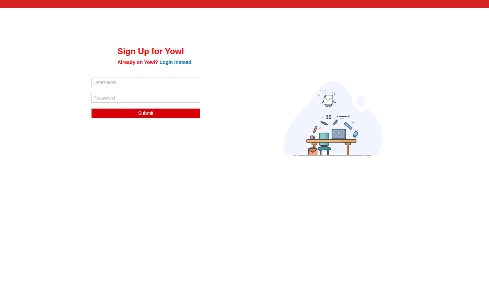
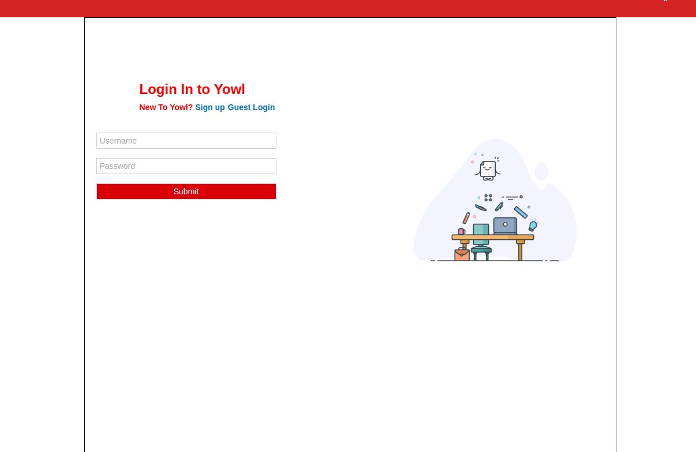
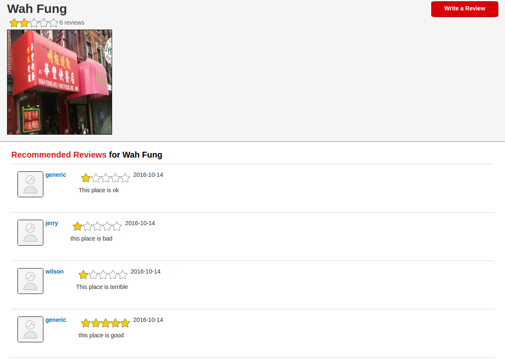

# Yowl

[Live link][heroku]

[heroku]: http://yowl.eugenecheng.club

Yowl is a web application that is based on Yelp and built with Ruby on Rails on the back-end, with a PostgresQL database, and React/Redux on the front-end. Right Now, users can make an account and review a select number of restaurants, with a google map mapping their locations.

## Features So Far

### User Log In/Sign Up

Users can create a an account and log in with account. The back end authentication for users was implemented using Ruby's BCrypt gem, which encrypts the password and having this hashed password stored in the database.

### Writing Reviews

When logged in, users can write reviews for restaurants in the database. Currently, users can only write reviews for pre-seeded restaurants in the database. I would like to add the ability for user's to create new businesses.

## Features To Add Soon

### User Profile Page

I want to add a User profile page where users can keep track of all their reviewws and customize their information and profile picture

### Marking reviews

I want users to be able to mark reviews as interesting, funny, cool, etc.. I would implement this feature using the MVC pattern and have each marking be represented by an object.

### Improve Business Show pages

Instead of just saving all it's reviews, business show pages should also hold other information about the business, such as price, hours of operation, and additional pictures.
